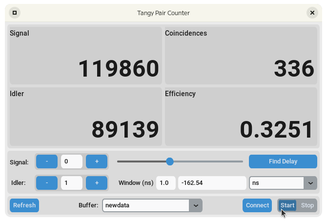

# Welcome to tangy 🍊

*tangy* is a high performance library to buffer timetags from timetaggers and files and provides soft-realtime analysis.

## About
It stores your timetag data in a circular buffer backed by shared memory allowing you to have multiple client connect to the same buffer.
When streaming data from a device into a tangy buffer this allows you to have multiple connections to the same device facilitating either mulitple lab users or multiple concurrent experiments.
Alternatively, if you have a large file of containing timetags you can read a section into a tangy buffer in one python interpreter and perform analysis on that section in another speeding up exploratory analysis.


## Features
- Support for different timetag formats
- A client-server model for buffering and analysis
- Analysis for:
    - Singles counting
    - Coincidence counting
    - Delay finding

## Installation
```sh title="pypi"
python3 -m pip install tangy
python3 -m pip install tangy[gui] # if you intend on using the guis
```

### Advanced
Install from git to get the latest version
```sh title="git"
python3 -m pip install git+https://gitlab.com/PeterBarrow/tangy.git
```

## Examples

Open a file and read some data
```python
import tangy

target_file = 'tttr_data.ptu'

n = int(1e7)
name = "tagbuffer"
# Open the file
ptu = tangy.PTUFile(target_file, name, n)

# Read some data from the file
for i in range(11):
    start_time = perf_counter()
    a = ptu.read(1e6)
    stop_time = perf_counter()
    run_time += (stop_time - start_time)
    print([ptu.record_count, ptu.count])

# Acquire the buffer
buffer = ptu.buffer()
```

```python title="Count coincidences in the last second for channels [0, 1] with a 1ns window"
integration_time = 1
coincidence_window = 1e-9
channels = [0, 1]
count = buffer.coincidence_count(integration_time, coincidence_window, channels)
```

```python title="Collect coincident timetags"
records = buffer.coincidence_collect(integration_time, coincidence_window, channels)
```

```python title="Find the delays between pairs of channels"
channel_a = 0
channel_b = 1
integration_time = 10
measurement_resolution = 6.25e-9
result_delay = tangy.find_delay(buffer,
                                channel_a channel_b,
                                integration_time,
                                resolution=measurement_resolution)
delays = [0, result_delay.t0]
```

```python title="Count (or collect) coincidences with delays"
count = buffer.coincidence_count(integration_time,
                                 coincidence_window,
                                 channels,
                                 delays=delays)

records = buffer.coincidence_collect(integration_time,
                                     coincidence_window,
                                     channels,
                                     delays=delays)
```


## Tools



